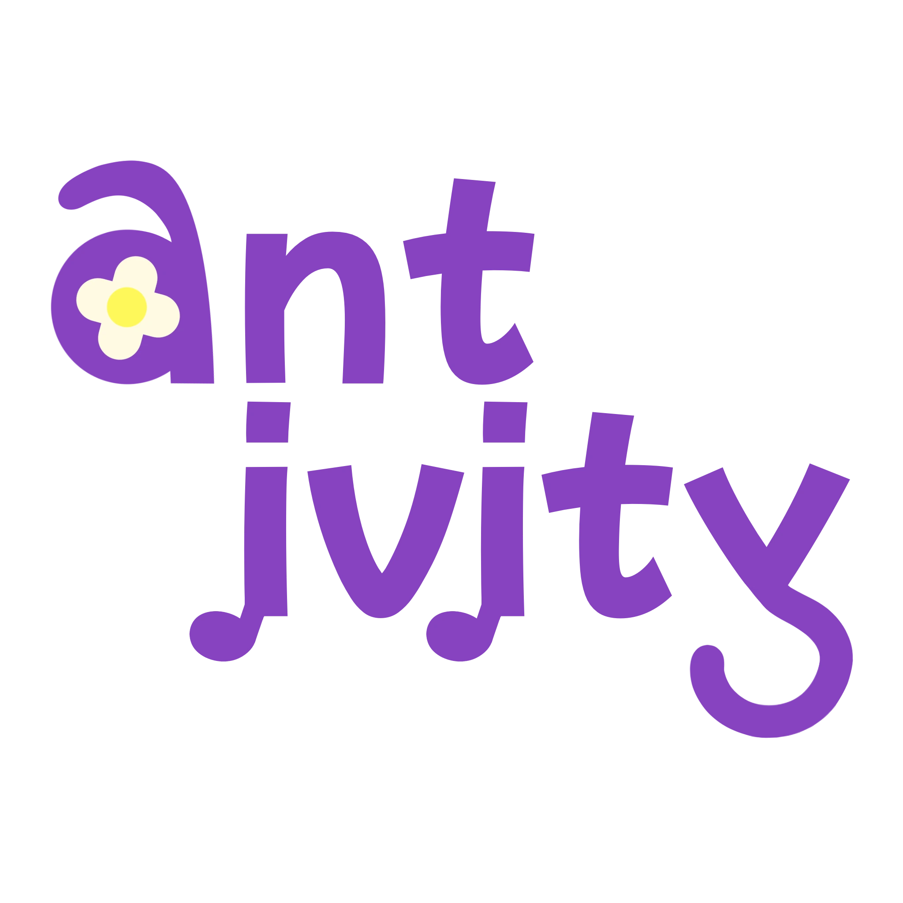

<h1 align="center">Antivity — Walk with Purpose</h1>

  
  
  **Antivity gives more purpose to your walk. Discover things, notice your surroundings, and make every step more meaningful.**
  
  
  
  
  
  

## 🌟 Features

### 🎯 Mission System

- **Daily Missions**: Gamified walking challenges with specific objectives
- **Random Target Generation**: Dynamic objectives like finding "Cat", "Car", "Tree", etc.
- **Mission Progress Tracking**: Personal mission status and completion tracking
- **AI-Powered Validation**: Uses **Gemini AI** to validate found objects in photos

### 🏆 Achievement System

- **Badge Collection**: Earn badges based on completed missions
- **Progress Tracking**: Unlock badges after completing certain numbers of missions
- **Profile Display**: Showcase earned badges on your profile

### 📱 Social Features

- **Social Feed**: Share photos from your walks with captions
- **Follow System**: Follow and unfollow other users
- **Like & Comment**: Engage with posts through likes and replies
- **User Search**: Discover people and posts with advanced search
- **Profile Sharing**: Share profile links with others

### 📖 Journal & Memory Keeping

- **Photo Journal**: Automatic creation of journal entries from walks
- **Story Generation**: Each walk creates a story with title and content
- **Calendar View**: Browse journal entries by date
- **Image Gallery**: View and download photos from walks
- **Walk History**: Track all previous walking sessions

### 👤 Profile Management

- **Customizable Profiles**: Display name, username, bio, and avatar
- **Photo Gallery**: Display user's walk photos in organized grids
- **Activity Statistics**: Track walking sessions, followers, and following
- **Badge Showcase**: Display earned achievements

### 📸 Camera & Location Features

- **Real-time Camera**: Take photos during walks to complete objectives
- **GPS Tracking**: Location-based walking sessions
- **Session Management**: Track walk duration, distance, and photos
- **Offline Support**: Continue walking even without internet connection

## 🛠 Tech Stack

### Frontend

- **Next.js 14** - React framework with App Router
- **TypeScript** - Type-safe development
- **Tailwind CSS v4** - Modern utility-first CSS framework
- **shadcn/ui** - Beautiful and accessible UI components
- **PWA Support** - Progressive Web App capabilities

### Backend & Services

- **Firebase Authentication** - Secure user authentication
- **Firestore Database** - NoSQL database for real-time data
- **Firebase Storage** - Image and file storage
- **Gemini AI** - Image validation and object recognition

### Mobile & Performance

- **Responsive Design** - Mobile-first approach
- **Image Optimization** - Next.js Image component

## 🚀 Getting Started

### Prerequisites

- Node.js 18+
- npm or yarn
- Firebase project
- Gemini AI API key

### Installation

1. **Clone the repository**
   \`\`\`bash
   git clone https://github.com/Ayash13/antivity.git
   cd antivity
   \`\`\`

2. **Install dependencies**
   \`\`\`bash
   npm install

   # or

   yarn install
   \`\`\`

3. **Set up environment variables**

   Create a `.env.local` file in the root directory:
   \`\`\`env

   # Firebase Configuration

   NEXT_PUBLIC_FIREBASE_API_KEY=your_firebase_api_key
   NEXT_PUBLIC_FIREBASE_AUTH_DOMAIN=your_project.firebaseapp.com
   NEXT_PUBLIC_FIREBASE_PROJECT_ID=your_project_id
   NEXT_PUBLIC_FIREBASE_STORAGE_BUCKET=your_project.appspot.com
   NEXT_PUBLIC_FIREBASE_MESSAGING_SENDER_ID=your_sender_id
   NEXT_PUBLIC_FIREBASE_APP_ID=your_app_id
   NEXT_PUBLIC_FIREBASE_MEASUREMENT_ID=your_measurement_id

   # Gemini AI Configuration

   GOOGLE_GENERATIVE_AI_API_KEY=your_gemini_api_key

   # Development URLs

   NEXT_PUBLIC_DEV_SUPABASE_REDIRECT_URL=http://localhost:3000
   \`\`\`

4. **Set up Firebase**

   - Create a new Firebase project
   - Enable Authentication (Email/Password)
   - Set up Firestore Database
   - Configure Firebase Storage
   - Add your domain to authorized domains

5. **Set up Gemini AI**

   - Get your API key from [Google AI Studio](https://aistudio.google.com/apikey)
   - Add the key to your environment variables

6. **Run the development server**
   \`\`\`bash
   npm run dev

   # or

   yarn dev
   \`\`\`

7. **Open your browser**

   Navigate to [http://localhost:3000](http://localhost:3000)

### Firebase Database Structure

The app uses the following Firestore collections:

\`\`\`
users/
{uid}/ - displayName, username, bio, photoURL, createdAt
missions/
{missionId}/ - missionId, status
pathSessions/
{sessionId}/ - createdAt, items, selfieImageUrl, totalDistance
journal/
{journalId}/ - storyTitle, storyContent, resultImageUrl, createdAt
followers/
{followerId}/ - followerId, createdAt
following/
{followingId}/ - followingId, createdAt

mission/
{missionId}/ - title, description, imageUrl, status

badge/
{badgeId}/ - name, badgeUrl, mission (required count)

posts/
{postId}/ - uid, content, images, createdAt, likes
replies/
{replyId}/ - uid, content, createdAt
\`\`\`

## 📱 Usage

### Getting Started

1. **Create Account**: Sign up with email and password
2. **Set Profile**: Add your display name, username, and avatar
3. **Grant Permissions**: Allow camera and location access
4. **Start Walking**: Begin your first mission from the main screen

### Completing Missions

1. **Select Mission**: Choose from available daily missions
2. **Start Walking**: Tap "Start" to begin your walking session
3. **Find Objects**: Use your camera to find the required objects
4. **Take Photos**: Capture images of the objects you find
5. **Complete Mission**: Finish your walk and earn badges

### Social Interaction

1. **Share Photos**: Post your favorite walk photos to the social feed
2. **Follow Users**: Connect with other walkers in your community
3. **Engage**: Like and comment on posts from people you follow
4. **Discover**: Use search to find new people and interesting content

## 🎨 Design System

Antivity uses a cohesive design system with:

- **Primary Colors**: Light blue (#6CD3FF), Blue (#50B0FF)
- **Accent Colors**: Purple (#7D47B9), Yellow (#FAD02C)
- **Typography**: Ubuntu font family with multiple weights
- **Shadows**: Consistent drop shadows using the blue color palette
- **Rounded Corners**: Generous border radius for friendly appearance

## 🔧 Development

### Project Structure

\`\`\`
antivity/
├── app/ # Next.js App Router pages
│ ├── (nav)/ # Pages with navigation
│ │ ├── main/ # Main mission screen
│ │ ├── social/ # Social feed and interactions
│ │ ├── journal/ # Photo journal and history
│ │ └── profile/ # User profiles and settings
│ ├── sign-in/ # Authentication pages
│ └── path/ # Walking session pages
├── components/ # Reusable UI components
├── context/ # React context providers
├── lib/ # Utility functions and Firebase
│ └── firebase/ # Firebase service functions
├── public/ # Static assets
└── hooks/ # Custom React hooks
\`\`\`

### Key Components

- **AuthGuard**: Protects routes requiring authentication
- **BottomNav**: Main navigation component
- **SwipeableCardStack**: Mission card interface
- **PermissionDialog**: Camera/location permission requests

### Firebase Services

- **Authentication**: User sign-up, sign-in, and session management
- **Firestore**: Real-time database operations
- **Storage**: Image upload and retrieval
- **Missions**: Mission management and progress tracking
- **Badges**: Achievement system
- **Social**: Follow system, posts, and interactions

## 🤝 Contributing

We welcome contributions! Please follow these steps:

1. Fork the repository
2. Create a feature branch (`git checkout -b feature/amazing-feature`)
3. Commit your changes (`git commit -m 'Add amazing feature'`)
4. Push to the branch (`git push origin feature/amazing-feature`)
5. Open a Pull Request

### Development Guidelines

- Follow TypeScript best practices
- Use the existing design system
- Write meaningful commit messages
- Test your changes thoroughly
- Update documentation as needed

## 📄 License

This project is licensed under the MIT License - see the [LICENSE](LICENSE) file for details.

## 🙏 Acknowledgments

- **Gemini AI** for providing intelligent image validation
- **Firebase** for robust backend infrastructure
- **Next.js** team for the excellent React framework
- **shadcn/ui** for beautiful UI components
- **Tailwind CSS** for the utility-first CSS framework

---

Transform your daily walks into meaningful adventures with Antivity!
